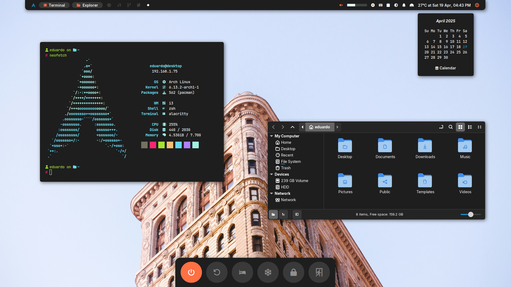

<div align="center">
  <h1>Linux Dotfiles</h1>
  <h3>My Desktop Configuration</h3>
</div>
<br>



## 🖇️ Dependencies

You can read about the packages I use on the [wiki](https://github.com/edu-flores/linux-dotfiles/wiki). To replicate my setup, run `scripts/install.sh` on a fresh Arch Linux install. Here's a quick summary about the main packages used:

| Usage                | Package   |
|----------------------|-----------|
| Window Manager       | i3        |
| Status Bar           | Polybar   |
| Terminal Emulator    | Alacritty |
| Notification Daemon  | Dunst     |
| Compositor           | Picom     |
| Launcher & Applets   | Rofi      |

Some of the status bar modules need manual configuration. Check `.env.example` for guidance.

### Weather Setup

To enable the weather module, create a `~/.env` file with your location ID and [OpenWeatherMap](https://openweathermap.org/) API key.

### Audio Setup

Use `pactl list short sinks` to find your audio device IDs and configure them in the `.env` file.

## ⌨️ Keybindings

```bash
# Switch between workspaces
bindsym $mod+Tab workspace back_and_forth

# Center focused window
bindsym $mod+Shift+c move position center

# Open color picker
bindsym $mod+o --release exec xcolor -s -S 3

# Show clipboard history
bindsym $mod+v exec CM_LAUNCHER=rofi clipmenu -config ~/.config/rofi/clipboard.rasi -i

# Clear clipboard history
bindsym $mod+Shift+v exec clipdel -d ".*"

# Launch applications
bindsym $mod+space exec rofi -config ~/.config/rofi/rofi.rasi -show drun

# Switch to light mode
bindsym $mod+bracketleft exec ~/.config/i3/scripts/theme.sh light

# Switch to dark mode
bindsym $mod+bracketright exec ~/.config/i3/scripts/theme.sh dark

# Take a screenshot
bindsym Print exec XDG_CURRENT_DESKTOP=X-Cinnamon flameshot gui
```

## ⚠️ Disclaimer

These dotfiles are under active development. I recently moved from a retro to a modern design. For the older setup, check the `prev` branch.
