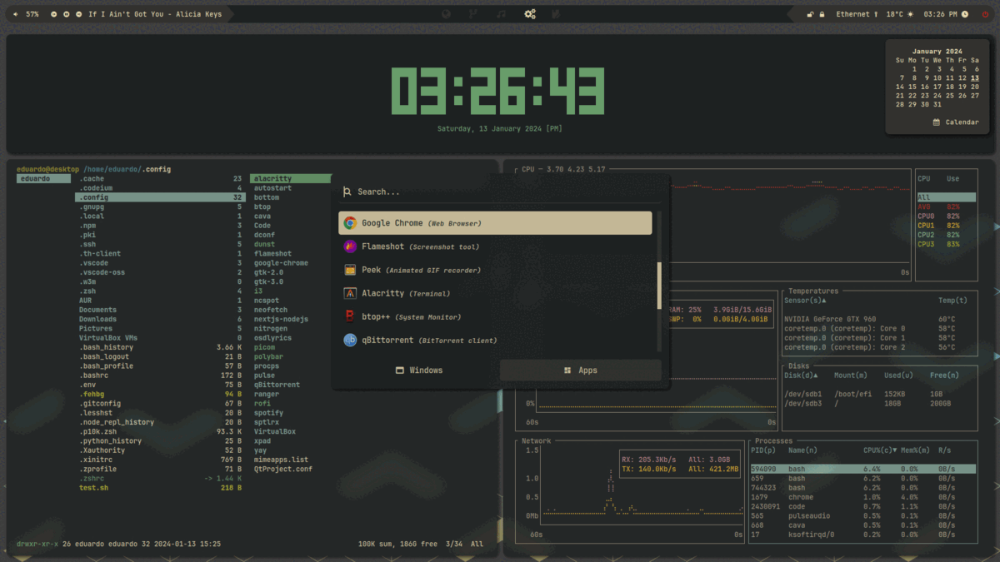

<div align="center">
    <h1>Linux Dotfiles</h1>
    <h3>My Desktop Configuration</h3>
</div>
<br>



## 🎨 Theme Configuration

### Manual Theme Selection

You can manually set a theme by executing the following script:

```bash
$ ./path/to/script/set_theme.sh [num]
```

Where `[num]` corresponds to the theme options:

- `1` 🏙️ Everforest
- `2` 🌇 Gruvbox
- `3` 🌆 Tokyo Night
- `4` 🌃 Nord

### Automated Theme Switching

Alternatively, you can automate theme changes based on the time of day using a cronjob with environment variables. Here's an example:

```bash
# Set up a cronjob to change the theme every day at 8:00, 12:00, 16:00 and 20:00.

DBUS_SESSION_BUS_ADDRESS=unix:path=/run/user/1000/bus
DISPLAY=:0
XDG_RUNTIME_DIR=/run/user/1000

0 8,12,16,20 * * * ~/path/to/script/set_theme.sh
```

**Note:** Adjust the paths and environment variables according to your specific setup.

## 🖇️ Dependencies

You can read about the packages I use on the [wiki](https://github.com/edu-flores/linux-dotfiles/wiki). To easily set up the dotfiles you can run `link_files.sh` from the repo root to make the necessary symlinks. Similarly on a fresh Arch install, you can run `rice_desktop.sh` from the repo root to set your desktop just like mine.

For the Polybar weather module to work, you should create a `~/.env` file, containing your location id and api key. For more information, consult [here](https://openweathermap.org/).

## ⌨️ Bindings

Show application launcher
```bash
bindsym $mod+space exec rofi -show drun
```

Show clipboard history
```bash
bindsym $mod+v exec CM_LAUNCHER=rofi clipmenu -p "󰅇 Clipboard"
```

Delete clipboard history
```bash
bindsym $mod+Shift+v exec clipdel -d ".*"
```

Show opened windows
```bash
bindsym Mod1+Tab exec rofi -show window
```

Launch snipping tool
```bash
bindsym Print exec flameshot gui
```
